# Итоговый проект курса «DevOps-инженер с нуля» Манукян Степан
# Тема итоговой работы - Базовая DevOps‑инфраструктура в Yandex.Cloud
* [Описание проекта:](#описание-проекта)
  * [Инструкция по выполнению работы:](#инструкция-по-выполнению-работы)
  * [Решение:](#решение)
  * [Финальная проверка:](#финальная-проверка)

**Перед началом работы над дипломным заданием изучите [Инструкция по экономии облачных ресурсов](https://github.com/netology-code/devops-materials/blob/master/cloudwork.MD).**

---

## Описание проекта:
В итоговой работе вы должны продемонстрировать упрощённый DevOps‑цикл для тестового веб‑приложения:

1. В облаке Yandex.Cloud развёрнута инфраструктура: сеть (VPC), подсеть и виртуальная машина, доступная из интернета по IP‑адресу, и backend для Terraform на базе S3‑совместимого хранилища;
2. На виртуальной машине установлен Docker (и при необходимости Docker Compose), система готова к запуску контейнеров.;
3. Есть тестовое приложение (например, nginx, отдающий статическую страницу), для него подготовлен Dockerfile и compose.yaml, а собранный Docker‑образ опубликован в выбранном реестре (Docker Hub или Yandex Container Registry).;
4. Настроен CI/CD‑pipeline (GitHub Actions, GitLab CI или аналог), который:
    при каждом коммите собирает Docker‑образ и отправляет его в реестр;
    при коммите в основную ветку (например, main) разворачивает новую версию приложения на виртуальной машине (обновляет контейнер).;
5. Подготовлена документация (README и отчёт), в которой вы описываете архитектуру решения, последовательность шагов, используемые инструменты и инструкции по повторному развёртыванию.

Результат должен быть воспроизводимым: другой человек, следуя вашей документации, должен суметь развернуть инфраструктуру и приложение с нуля.
---

## Инструкция по выполнению работы:

## 1. Подготовка облачной инфраструктуры
* **Создание репозитория:** Создайте новый репозиторий для Terraform‑конфигурации.
* **Установка инструмента:** Скачайте и установите Terraform, если ранее этого не делали.
* **Аутентификация:** Настройте аутентификацию Terraform в Yandex.Cloud (сервисный аккаунт, авторизационные данные).
* **Настройка backend:** Создайте S3‑bucket в Yandex.Cloud и настройте backend для хранения Terraform‑состояния.
* **Описание ресурсов:** Опишите в Terraform создание VPC, подсети и виртуальной машины.
* **Развертывание:** Проверьте конфигурацию командой `terraform plan`, затем примените её с помощью `terraform apply`.
* **Проверка доступа:** Убедитесь, что ВМ создана и доступна по SSH.
 
## 2. Установка Docker на виртуальной машине
* **Подключение:** Подключитесь по SSH к созданной ВМ.
* **Установка ПО:** Установите Docker (и при необходимости Docker Compose) одним из способов:
  * Вручную по официальной инструкции.
  * С помощью подготовленного Ansible‑playbook.
* **Тестирование:** Проверьте, что Docker работает: выполните команду `docker version` и запустите тестовый контейнер.
 
## 3. Подготовка тестового приложения
* **Создание репозитория:** Создайте отдельный репозиторий для тестового приложения.
* **Разработка:** Напишите простое приложение или статический сайт (можно на nginx), которое будет явно показывать, что деплой успешен (например, страница *«DevOps диплом: ваше имя»*).
* **Контейнеризация:** Создайте `Dockerfile` для сборки образа приложения.
* **Оркестрация:** Создайте `compose.yaml` для запуска приложения через Docker Compose (если вам нужен больше чем один контейнер, например, приложение + БД).
* **Проверка:** Локально соберите образ и протестируйте его запуск.
 
## 4. Публикация образа в реестре
* **Регистрация:** Зарегистрируйтесь в Docker Hub или создайте Yandex Container Registry.
* **Авторизация:** Настройте логин к реестру.
* **Push образа:** Соберите образ и отправьте его в реестр (`docker push` или через CI).
 
## 5. Настройка CI/CD
* **Конфигурация пайплайна:** В репозитории приложения создайте конфигурацию CI/CD (например, `.github/workflows/ci‑cd.yml` для GitHub Actions).
* **Этапы пайплайна:** Добавьте обязательные шаги:
  * Сборка Docker‑образа.
  * Отправка образа в реестр.
  * Деплой на ВМ (через SSH, Ansible или другой выбранный вами способ).
* **Безопасность:** Настройте секреты (учётные данные для реестра и доступа к ВМ) в настройках репозитория.
* **Проверка автоматизации:** Проверьте, что при коммите в ветку `main` pipeline успешно проходит и приложение обновляется на ВМ.
 
## 6. Документация и финальная проверка
* **Ссылки:** Соберите все ссылки на репозитории и реестр в один файл `README`.
* **Описание:** Опишите архитектуру, шаги развёртывания и проверки работоспособности.
* **Отказоустойчивость:** Убедитесь, что при `terraform destroy` инфраструктура корректно удаляется, а при повторном `terraform apply` и настройке CI/CD всё снова поднимается и работает.

---
## Структура итоговой работы

* **Подробный README** с проектированием инфраструктуры и решениями, которые принимали при проектировании.
* **3 репозитория на GitHub:**
  * Репозиторий с конфигурационными файлами Terraform.
  * Репозиторий с конфигурацией Ansible.
  * Репозиторий с `Dockerfile`, `compose.yaml` тестового приложения и ссылка на собранный docker image.

## Отправка на проверку

1. Вставьте ссылку на вашу работу в поле **«Ссылка на решение»**.
2. Нажмите кнопку **«Отправить на проверку»**.
3. *При необходимости:* Перед отправкой итогового проекта вы можете написать комментарий эксперту и задать ваши вопросы.

---

## Решение:

`Для выполнения работы, будет использовать уже настроенную рабочую машину с ОС Debian GNU/Linux 12 (bookworm), со следующими компонентами:`
```
Terraform v1.12.2
Ansible 2.14.18
Docker 20.10.24
Git 2.39.5
Yandex Cloud CLI 1.34.0
```

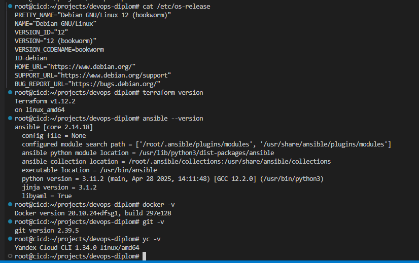

### 1. Подготовка облачной инфраструктуры

### Создайте новый репозиторий для Terraform‑конфигурации.

Конфиграция Terraform https://github.com/StepanST1/devops-diploma-terraform

### Скачайте и установите Terraform, если ранее этого не делали.
`Terraform ранее был установлен`

### Настройте аутентификацию Terraform в Yandex.Cloud (сервисный аккаунт, авторизационные данные)

Для начала нужно создать сервисный аккаунт с правами editor
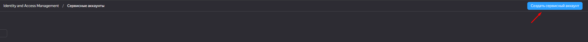
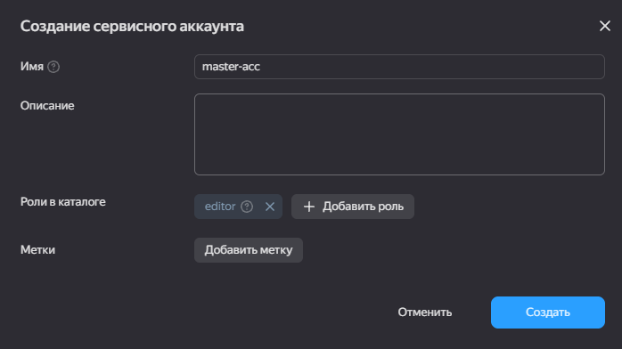

Далее создаем "Авторизованный ключ" для созданого сервисного аккаунта
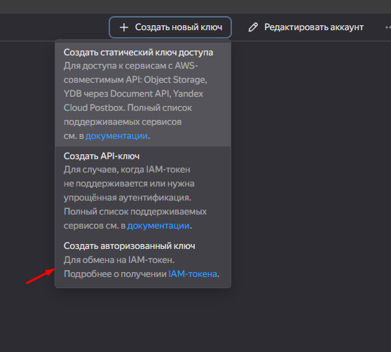

И так же создадим Статический ключ
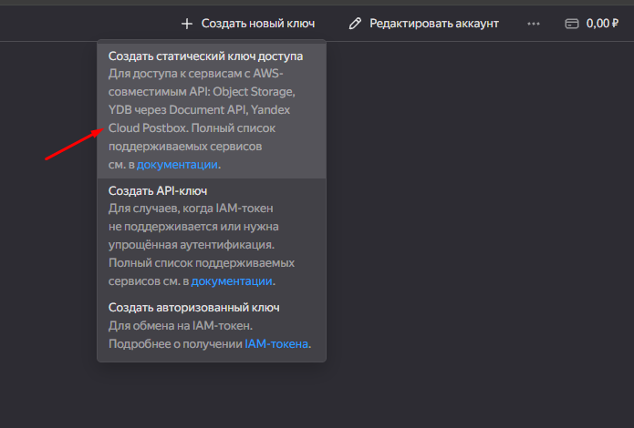

`Переменные ACCESS_KEY и SECRET_KEY будут записаны в файл .env Эти переменные будут в экспортированы в оболочку рабочего окружения.`

### Создайте S3‑bucket в Yandex.Cloud и настройте backend для хранения Terraform‑состояния.

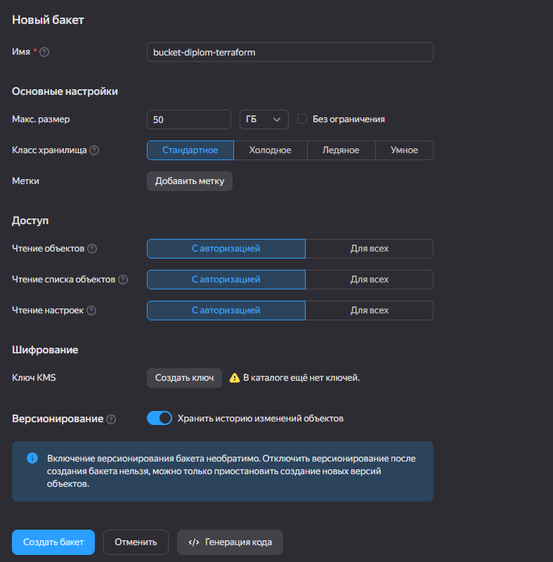

В результате данных действий  был создан сервисный аккаунт с правами для редактирования, статический ключ доступа и S3-bucket. 

providers.tf
```
  backend "s3" {
    endpoint                    = "https://storage.yandexcloud.net"
    bucket                      = "bucket-diplom-terraform"
    region                      = "ru-central1"
    key                         = "state-terraform.tfstate"
    
    skip_region_validation      = true
    skip_credentials_validation = true
    skip_requesting_account_id  = true 
    skip_s3_checksum            = true 
  }
```

### Опишите в Terraform создание VPC, подсети и виртуальной машины.

Terraform создаёт следующие ресурсы в Yandex Cloud:

| Ресурс | Имя / параметры | Назначение |
|---|---|---|
| VPC | `diplom-network` | Изолированная виртуальная сеть |
| Subnet | `diplom-network-subnet` | Подсеть `10.0.1.0/24` в зоне `ru-central1-a` |
| Security Group | `diplom-security-group` | Правила сетевого доступа к VM |
| Compute VM | `diplom-vm` | Сервер для запуска контейнерного приложения |
| Boot disk | 15 GB, `network-hdd` | Системный диск VM |
| OS image | Ubuntu 22.04 LTS | Операционная система VM |
| Public NAT IP | Выделяется автоматически | Доступ к VM из интернета |

Параметры VM:

- Platform: `standard-v3`
- vCPU: 2
- RAM: 2 GB
- Core fraction: 20%
- Disk: 15 GB `network-hdd`
- Scheduling policy: `preemptible = true`
- Availability zone: `ru-central1-a`
- SSH user: `ubuntu`

#### Сетевые правила

Security Group содержит следующие правила:

| Направление | Протокол | Порт | Источник / назначение |
|---|---|---:|---|
| Ingress | TCP | 22 | `0.0.0.0/0` |
| Ingress | TCP | 80 | `0.0.0.0/0` |
| Egress | Any | Все | `0.0.0.0/0` |

### Проверьте конфигурацию командой terraform plan, затем примените её с помощью terraform apply.

```bash

export AWS_ACCESS_KEY_ID="<static-access-key-id>"
export AWS_SECRET_ACCESS_KEY="<static-secret-access-key>"

terraform init
terraform plan
terraform apply
```
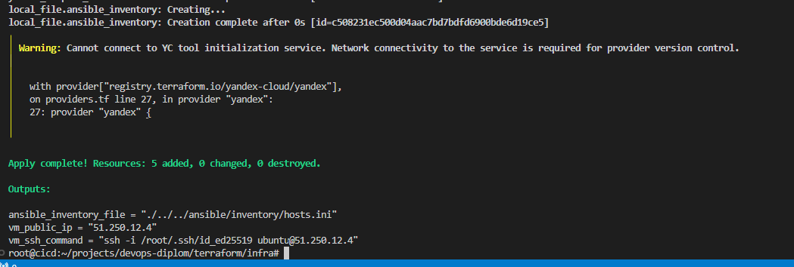

### Убедитесь, что ВМ создана и доступна по SSH.
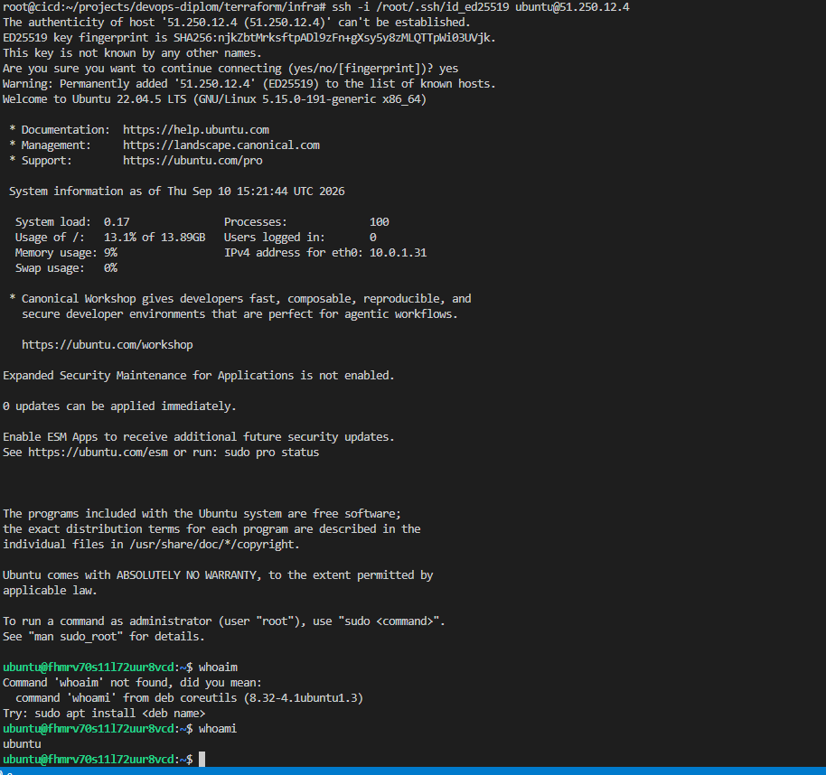

## 2. Установка Docker на виртуальной машине

* Подключитесь по SSH к созданной ВМ.
* Установите Docker (и при необходимости Docker Compose):
* **либо вручную по официальной инструкции; **
* **либо подготовьте Ansible‑playbook и примените его. **
* Проверьте, что Docker работает: выполните docker version и запустите тестовый контейнер.

# Выполнение Ansible‑playbook

Конфиграция Ansible https://github.com/StepanST1/devops-diplom-ansible

Terraform после `apply` создаёт Ansible inventory с актуальным публичным IP VM. Это устраняет необходимость вручную переносить IP из Terraform в Ansible.

## Ansible playbook выполняет следующие действия на VM:

- устанавливает зависимости `ca-certificates`, `curl`, `gnupg`;
- добавляет официальный Docker APT repository;
- устанавливает Docker;
- устанавливает Docker plugin;
- устанавливает Docker Compose plugin;
- запускает и включает Docker service;
- добавляет пользователя `ubuntu` в группу `docker`;
- проверяет доступность Docker

### Проверка подключения

```bash
cd ansible
ansible -i inventory/hosts.ini app -m ping
```

### Запуск playbook

```bash
ansible-playbook -i inventory/hosts.ini playbooks/docker.yml
```

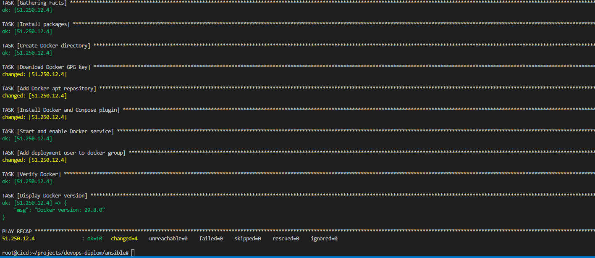

### Проверка Docker
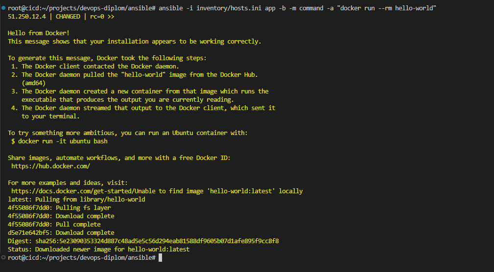

## 3. Подготовка тестового приложения

* Создайте отдельный репозиторий для тестового приложения.
* Напишите простое приложение или статический сайт (можно на nginx), которое будет явно показывать, что деплой успешен (например, страница «DevOps диплом: ваше имя»).
* Создайте Dockerfile для сборки образа приложения.
* Создайте compose.yaml для запуска приложения через Docker Compose (если вам нужен больше чем один контейнер, например, приложение + БД).
* Локально соберите образ и протестируйте его запуск.

# Выполнение

### Создайте отдельный репозиторий для тестового приложения.
Конфиграция APP https://github.com/StepanST1/devops-diploma-app

### Напишите простое приложение или статический сайт (можно на nginx), которое будет явно показывать, что деплой успешен (например, страница «DevOps диплом: ваше имя»).

```html

<!DOCTYPE html>
<html>
<head>
    <meta charset="UTF-8">
    <title>Netology DIPLOM</title>
</head>
<body>
    <h1>DevOps диплом: Степан</h1>
</body>
</html>
```

### Создайте Dockerfile для сборки образа приложения.
```# Шаг 1: Берем л образ Nginx Alpine Linux
FROM nginx:1.27-alpine
# Шаг 2: Удаляем дефолтную страницу Nginx
RUN rm -rf /usr/share/nginx/html/*
# Шаг 3: Копируем наш файлы в рабочую директорию веб-сервера
COPY index.html /usr/share/nginx/html/index.html
COPY nginx/default.conf /etc/nginx/conf.d/default.conf
# Шаг 4: Открываем HTTP-порт 80 внутри контейнера
EXPOSE 80
# Шаг 5: Запускаем Nginx в фоновом режиме
CMD ["nginx", "-g", "daemon off;"]
```

### Локально соберите образ и протестируйте его запуск.
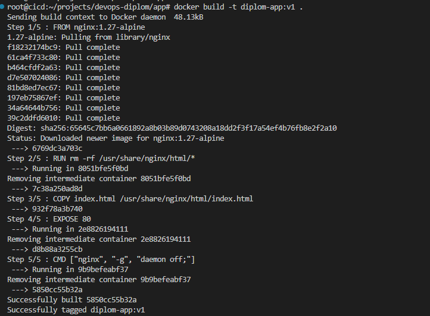
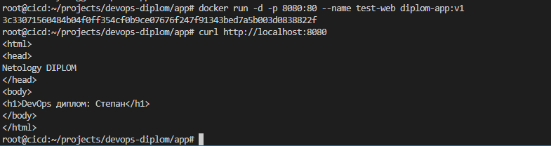

## 3. Публикация образа в реестре

### Соберите образ и отправьте его в реестр (docker push или через CI).

Авторизуюсь в Docker Hub:
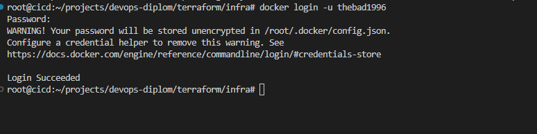

Создадим Docker образ:
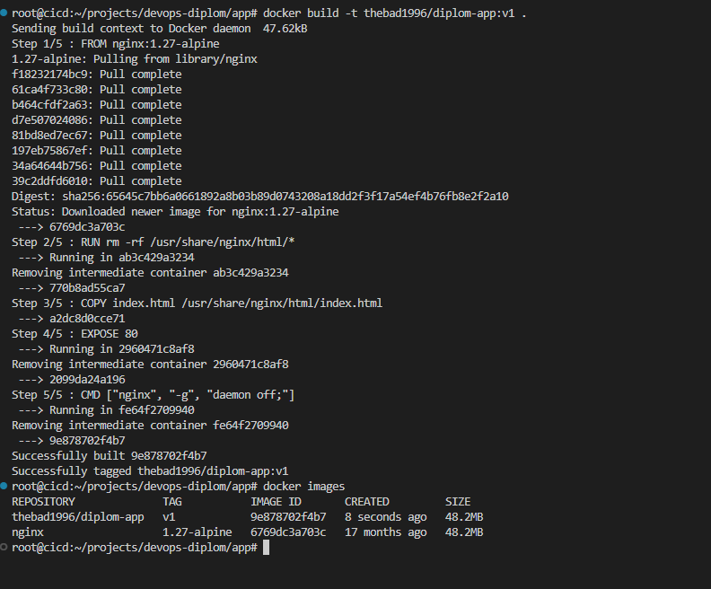

Публикация созданный образ реестре Docker Hub:
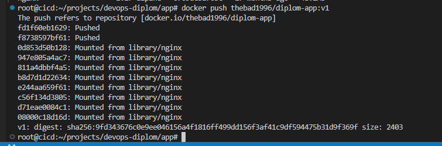

Проверка
https://hub.docker.com/r/thebad1996/diplom-app
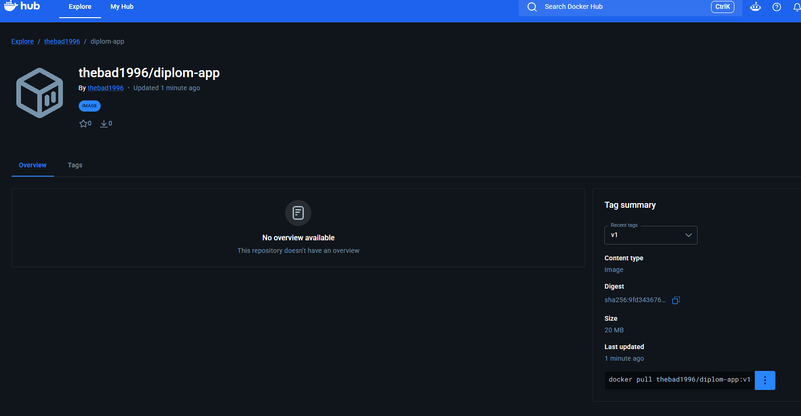

## 5. Настройка CI/CD
* В репозитории приложения создайте конфигурацию CI/CD (например, .github/workflows/ci‑cd.yml для GitHub Actions).
* Добавьте шаги:
* сборка Docker‑образа;
* отправка образа в реестр;
* деплой на ВМ (через SSH, Ansible или другой выбранный вами способ).
* Настройте секреты (учётные данные для реестра и доступа к ВМ) в настройках репозитория.
* Проверьте, что при коммите в ветку main pipeline успешно проходит и приложение обновляется на ВМ.

Создание отдельного SSH ключа для GitHub Actions чтобы не использовать админский

```bash
ssh-keygen -t ed25519 \
  -C "github-actions-deploy-diplom-app" \
  -f /root/.ssh/github_actions_deploy \
  -N ""
  ```
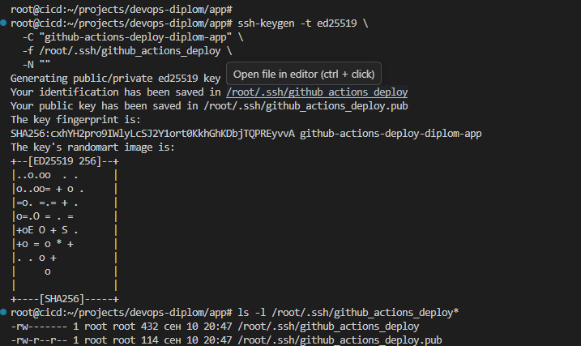

Дороботка playbooks чтобы Ansible добавлял SSH ключ для подлкючения GItHub на ВМ

```yaml
    - name: Add GitHub Actions deploy public key to VM
      ansible.posix.authorized_key:
        user: "{{ docker_user }}"
        state: present
        key: "{{ lookup('ansible.builtin.file', local_github_key_path) }}"
        manage_dir: true
```

### Создание Docker Hub token

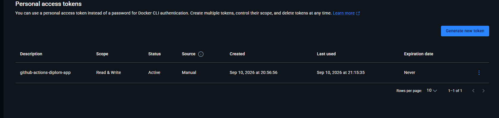

### Заполнение secrets в GitHub
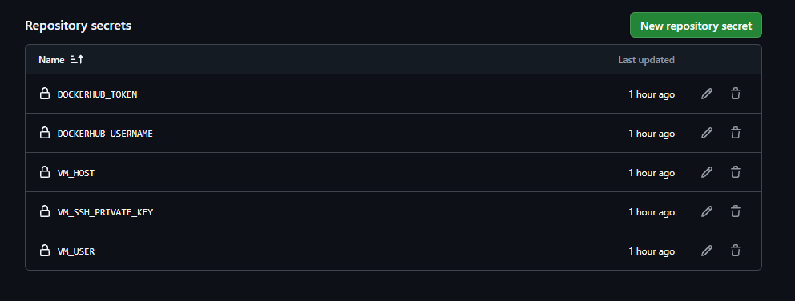

### Внесение измений в код

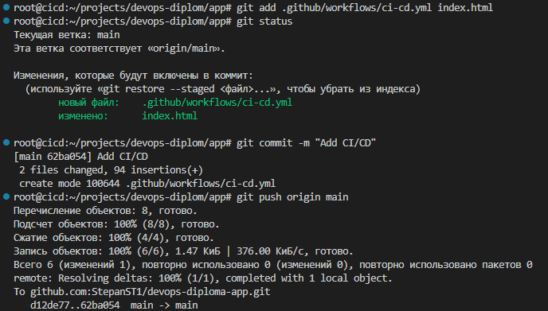

### Проверка в GitHub
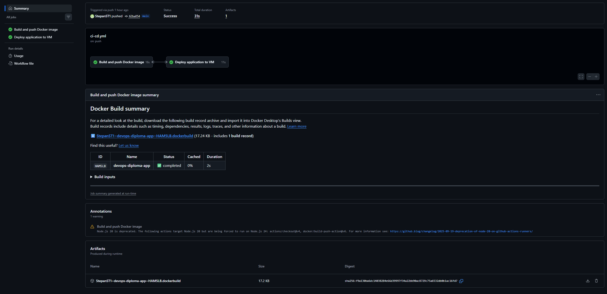

### Проверка в DockerHub
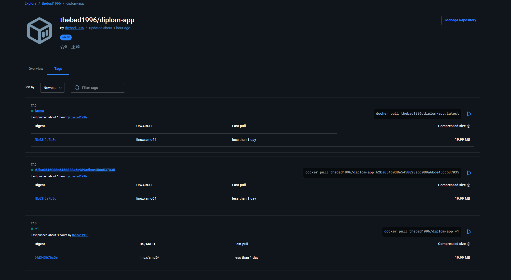

### Проверка на VM
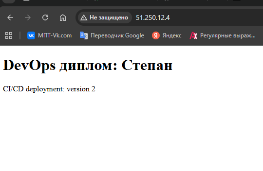

```bash
root@cicd:~/projects/devops-diplom/ansible# curl http://51.250.12.4/
<!DOCTYPE html>
<html>
<head>
    <meta charset="UTF-8">
    <title>Netology DIPLOM</title>
</head>
<body>
    <h1>DevOps диплом: Степан</h1>
  <p>CI/CD deployment: version 2</p>
</body>
</html>
```

# Финальная проверка

### Выполнение terraform destroy
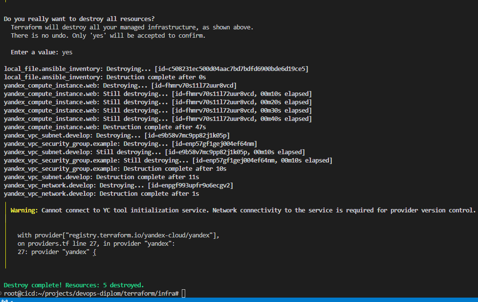

### Выполнение terraform apply и проверка SSH
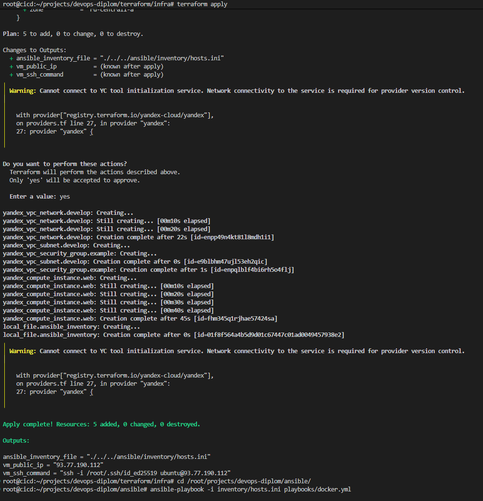

### Запуск Ansible
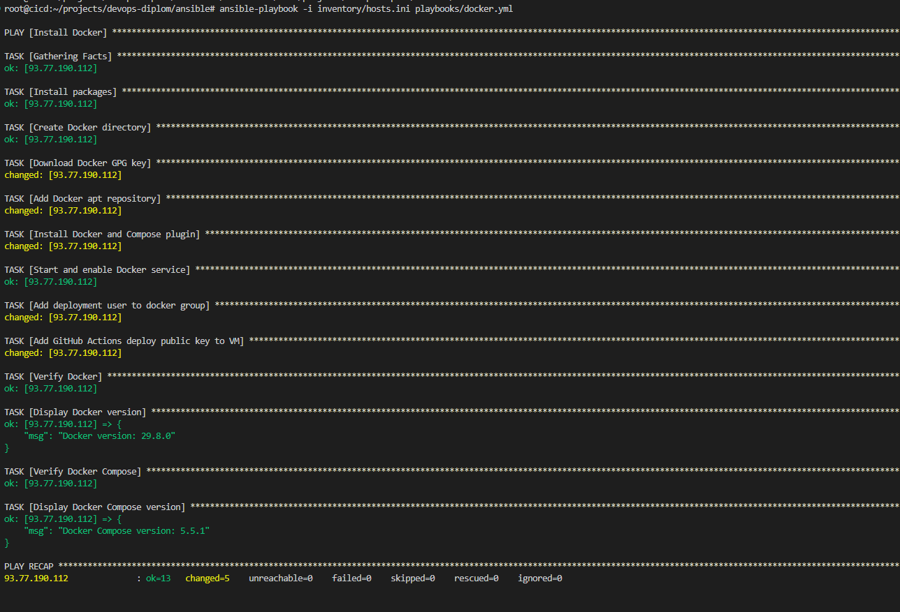

### Замена Secret в репозитории GIT
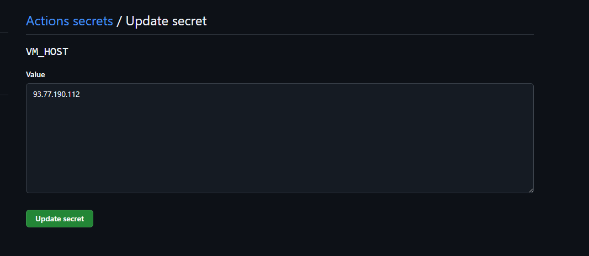

### Проверка CI/CD путем редактировния index и git push

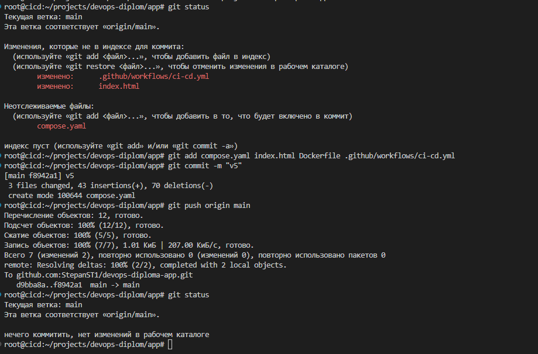
#### Git
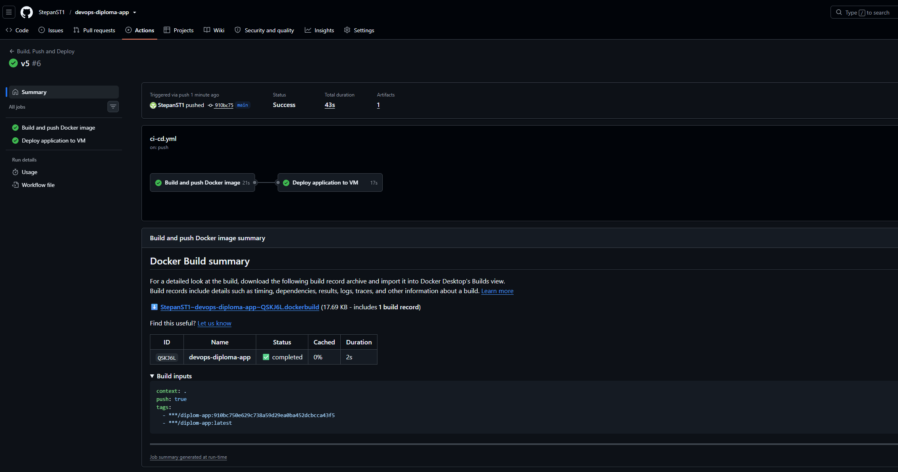
#### hub.docker
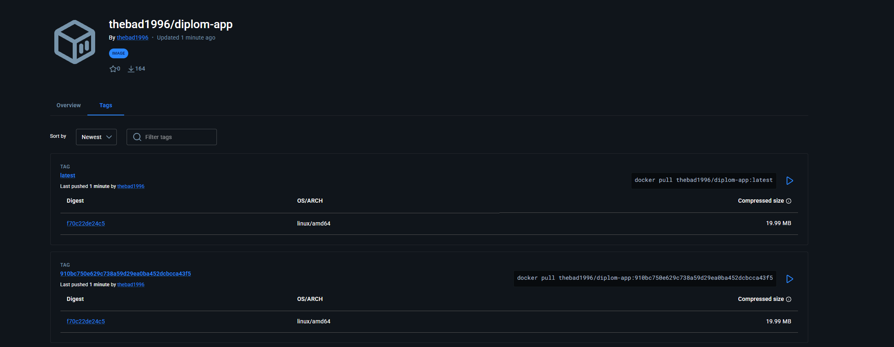
#### VM
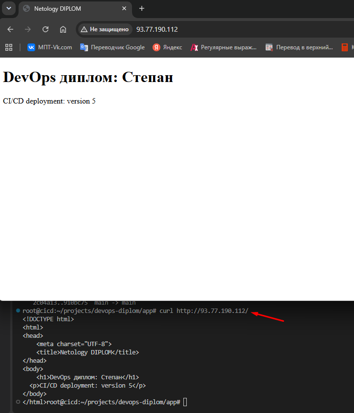
